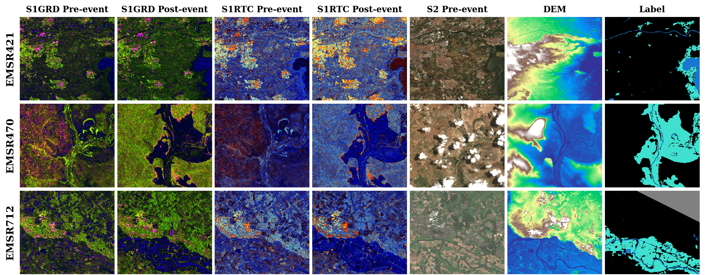
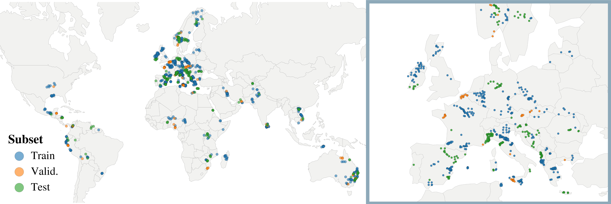

# GEOID-Flood

[](https://huggingface.co/datasets/links-ads/geoid-flood)
[](https://arxiv.org/abs/2608.02315)
[](LICENSE)
[](https://creativecommons.org/licenses/by/4.0/)
[](https://www.python.org/downloads/)

GEOID-Flood is a large-scale, multi-modal benchmark for flood segmentation built from
Copernicus Emergency Management Service (CEMS) Rapid Mapping activations. It spans 219 flood
events across 65 countries acquired between 2016 and 2026, decomposed into 14,282 tiles of
1024x1024 pixels. Each tile provides co-registered Sentinel-1 GRD and RTC (pre- and
post-event, VV/VH), a pre-event Sentinel-2 L2A composite, and a Copernicus GLO-30 DEM, all at
10 m resolution, together with manually validated three-class labels (background, permanent
water, flooded water). This repository contains the training/evaluation code and the
[TerraTorch](https://github.com/IBM/terratorch) experiment configs used in the paper.

The dataset itself, including full documentation of every modality, derived layer and label
value, is on the Hugging Face Hub at
[`links-ads/geoid-flood`](https://huggingface.co/datasets/links-ads/geoid-flood).



*Three GEOID-Flood events, all layers of a tile side by side. Flooded water is cyan, permanent
water blue, invalid pixels gray.*

## Installation

Requires **Python 3.11 or 3.12**. `terratorch` is pinned to **`==1.1`**

```bash
git clone git@github.com:links-ads/geoid-flood && cd geoid-flood
uv sync --extra scripts        # or: python3.12 -m venv .venv && .venv/bin/pip install -e ".[scripts]"
```

## Dataset



*The 219 activations span 65 countries. Splits are assigned per area of interest and touching
AoIs share a split, so no flood event straddles train, validation and test.*

The dataset is packaged as tar shards of Cloud-Optimized GeoTIFFs grouped by split
and modality; the [dataset card](https://huggingface.co/datasets/links-ads/geoid-flood)
documents every layer and the label encoding.

```bash
uv sync --extra scripts

# everything (~586 GB)
python scripts/get_data.py --dest data

# Just S1GRD data (~205 GB)
python scripts/get_data.py --dest data --layer s1grd label

# only the held-out evaluation set used by the S1-RTC configs (~20 GB)
python scripts/get_data.py --dest data --tree geoid-flood-heldout --layer s1rtc label

# preview a selection without downloading
python scripts/get_data.py --list --layer s1grd s2l2a dem label

# more shards in flight (4 saturates the link; higher only raises peak disk and RAM)
python scripts/get_data.py --dest data --layer s1grd --workers 4
```

To inspect the data without a large download, `--sample` fetches two complete event-AoIs from
activation EMSR712, with all nine layers for all
47 tiles, ~2.9 GB, plus a matching metadata file:

```bash
python scripts/get_data.py --sample --dest data
```

[`examples/sample_pipeline.yaml`](examples/sample_pipeline.yaml) runs against it end to end, to confirm
the download landed and the dataloader can read the rasters:

```bash
terratorch fit  --config examples/sample_pipeline.yaml
terratorch test --config examples/sample_pipeline.yaml \
  --ckpt_path workdir/sample/v1/checkpoints/last.ckpt
```

This is just a test with few samples, the [Training](#training) and [Testing](#testing) sections below assume the full dataset.

On-disk layout expected by the configs in this repository:

```
data/geoid-flood/
  data_tiles_s256_st128.csv
  tile_catalog.parquet
  EMSR151-1/ ... EMSR871-N/     # one directory per event-AoI
data/geoid-flood-heldout/       # EMSR857-871, cross-dataset held-out test set
```

Both trees carry the same two metadata files at their root:

| File | Role |
|---|---|
| `data_tiles_s256_st128.csv` | **The only metadata the dataloader reads.** One row per 256x256 chip per modality, enumerated at stride 128 for train and 256 for val/test. [Re-tiling](#re-tiling) below rebuilds it at any size. |
| `tile_catalog.parquet` | Inventory of the 1024x1024 tiles: geometry and UTM CRS, pre/post delineation times, `is_valid`, `invalid_pixel_frac`, countries and `split`. **`is_valid AND invalid_pixel_frac <= 0.95` is the paper's tile selection**, it yields 12,853 tiles here (8,938 / 1,241 / 2,674) and 1,429 in the held-out tree |

### Re-tiling

The rasters are 1024x1024; `data_tiles_s256_st128.csv` is one chip grid over them, and the
shipped one is an example, the one the paper's models use.
[`scripts/make_tiles.py`](scripts/make_tiles.py) rebuilds the inventory from
`tile_catalog.parquet` at any tile size and stride, or with no tiling at all, computing
`valid_proportion`, `positive_proportion` and `cloud_cover` from the label and cloud rasters
exactly as the original tiler did.

```bash
# 512x512 chips, stride 256 on train -> data/geoid-flood/data_tiles_s512_st256.csv
python scripts/make_tiles.py --data-root data/geoid-flood --tile-size 512 --stride 256

# 224x224, non-overlapping
python scripts/make_tiles.py --data-root data/geoid-flood --tile-size 224 --stride 224

# no chipping at all: one row per 1024x1024 raster per modality
python scripts/make_tiles.py --data-root data/geoid-flood --no-tiling

# only what an S1-GRD run needs, for one event
python scripts/make_tiles.py --data-root data/geoid-flood --modality s1grd --event EMSR332
```

Train the new grid by pointing a run at the file it wrote:

```bash
terratorch fit --config <cfg> --data.init_args.metadata_filename data_tiles_s512_st256.csv
```

Two things to know:

- **Which tiles are selected is the paper's rule.** `--valid-only` (default on) and
  `--max-invalid-frac` (default `0.95`) are the paper's two criteria, so a default run covers the
  12,853 / 1,429 tiles it reports. `--no-valid-only --max-invalid-frac 1.0` visits the whole catalog.
- **Non-overlapping evaluation is preserved.** `--stride` applies to train only; val and test
  use the tile size unless you override `--eval-stride`.

## Training

```bash
.venv/bin/terratorch fit --config configs/backbone_benchmark/terramind_base_frozen.yaml
```

Any config under `configs/` can be substituted. They are organised by experiment, following the
paper's three training scenarios plus the two ablation/generalization studies.

Each run writes TensorBoard scalars and checkpoints to `trainer.logger.init_args.save_dir/name/version`.

## Testing

```bash
terratorch test --config <cfg> --ckpt_path <ckpt>
```

Every training run writes checkpoints into `<save_dir>/<name>/<version>/checkpoints/`.

Each config selects on the metric the paper reports for that scenario, maximized: `val/IoU_1`
(binary water IoU) for the single-image and paired models, `val/IoU_flood` for the three-class
fusion models. 

To select on a different metric, change `monitor` and `mode` on both
`StateDictAwareModelCheckpoint` callbacks in the config and retrain. Any metric the task logs
works; `terratorch fit --config <cfg> --print_config` lists the full metric set.


## Three-class evaluation

The paper's three-class metrics (background / permanent water / flooded water, assembled from
paired pre/post inference) are computed by two standalone scripts that log directly to the
run's TensorBoard directory rather than through `terratorch test`.

Both take the same arguments:

```bash
python scripts/eval_flood_paired.py --config <cfg> --ckpt-path <ckpt> --device cuda
python scripts/eval_flood_fused.py  --config <cfg> --ckpt-path <ckpt> --device cuda
```

Both scripts log `test/F1_Score_Binary`, `test/Iou_Binary`, `test/F1_Score_MultiClass`,
`test/IoU_MultiClass`, `test/IoU_0`, `test/IoU_1_perm`, and `test/IoU_2_flood` to the resolved
TensorBoard directory at the checkpoint's step.

## License and citation

The code in this repository is released under the [MIT License](LICENSE).

The GEOID-Flood dataset is distributed separately under
[CC BY 4.0](https://creativecommons.org/licenses/by/4.0/). It contains modified Copernicus data;
the required attributions are on the
[Hugging Face dataset card](https://huggingface.co/datasets/links-ads/geoid-flood).

If you use this codebase or the GEOID-Flood benchmark, please cite:

```bibtex
@inproceedings{geoidflood2026,
  title     = {{GEOID-Flood}: A Large-Scale Multi-Modal Benchmark Dataset for Flood Segmentation},
  author    = {Chiriaco, Gaetano and Barco, Luca and Rossi, Claudio and
               Bragagnolo, Andrea and Arnaudo, Edoardo},
  booktitle = {ECCV 2026 Workshops (TerraBytes)},
  year      = {2026}
}
```
